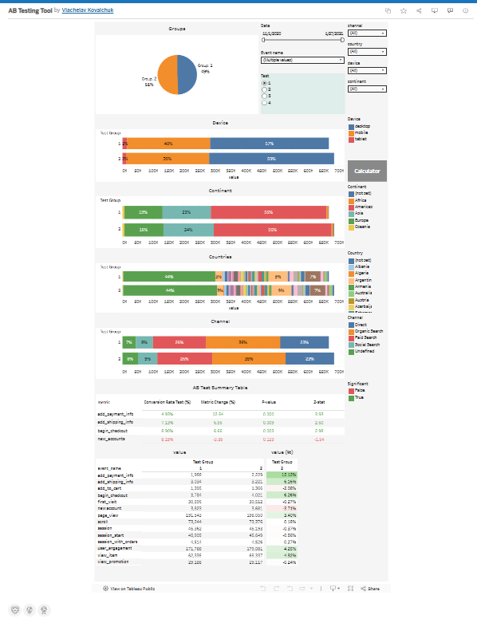

# A/B Testing Analysis

This project analyzes the results of product experiments using statistical methods in Python and visualizes the outcomes in Tableau.

## Project Overview

The goal of this project is to evaluate whether changes in product features lead to statistically significant improvements in conversion metrics.

Four key metrics were analyzed:

- add_payment_info / session
- add_shipping_info / session
- begin_checkout / session
- new_accounts / session

## Tools Used

- Python
- Pandas
- NumPy
- Statsmodels (Two-proportion Z-test)
- Tableau

## Analysis Steps

1. Data preparation and aggregation
2. Conversion rate calculation
3. Two-proportion Z-test
4. Statistical significance evaluation
5. Visualization of results in Tableau

## Example Metrics

| Metric | Conversion Rate Control | Conversion Rate Variant | Metric Change | P-value |
|------|------|------|------|------|
| add_payment_info | 4.38% | 4.93% | +12.5% | 0.00009 |

## Dashboard

The results are visualized in Tableau using an interactive dashboard.

## Key Insights

- Some metrics showed statistically significant improvements.
- Statistical testing confirmed whether observed differences were meaningful.

## Author

Viacheslav Kovalchuk  
Aspiring Data Analyst
